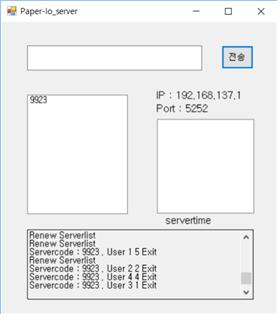
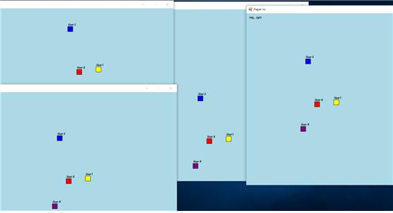

# Server-Client
약 2주의 기간동안 2단계의 목표를 설정하고 시작했지만 그중 1단계만 성공한 프로젝트
- 2단계 목표가 Paper-io의 구현이었기에 프로젝트 이름이 Paper-io가 되었다.

하나의 솔루션에 서버와 클라이언트 프로젝트로 구분하여 개발  
- 공유하는 모듈은 공유 라이브러리로 분리하여 사용
- 서버 - 클라이언트의 소켓 통신을 중점적으로 제작

서버를 먼저 켜고 클라이언트를 하나의 서버에 연결하면 여러 클라이언트가 연결되어 각자의 위치가 실시간으로 동기화된다.

- 서버 프로그램

- 클라이언트 프로그램들

- 4개의 클라이언트가 자신의 화면에서 같은 위치에 있는 것을 볼 수 있다.
- 키보드의 화살표를 통해서 자신의 위치를 움직일 수 있고, 이는 다른 클라이언트들에도 동일하게 보인다.
- 프로그램 특성상 계속 움직이기만 하기 때문에 같은 방향으로 지정하지 않으면 점점 멀어지게 된다.
